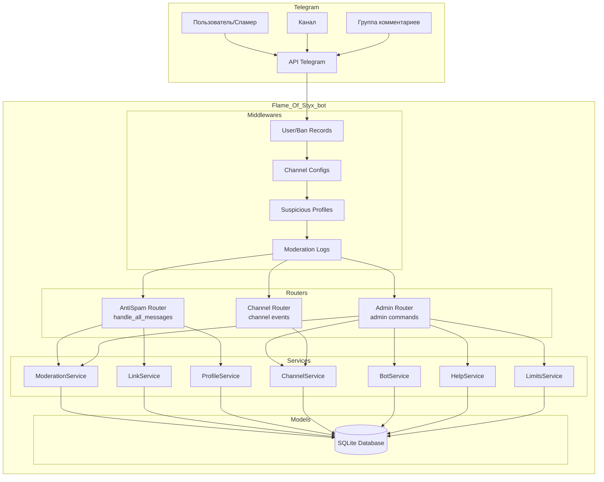
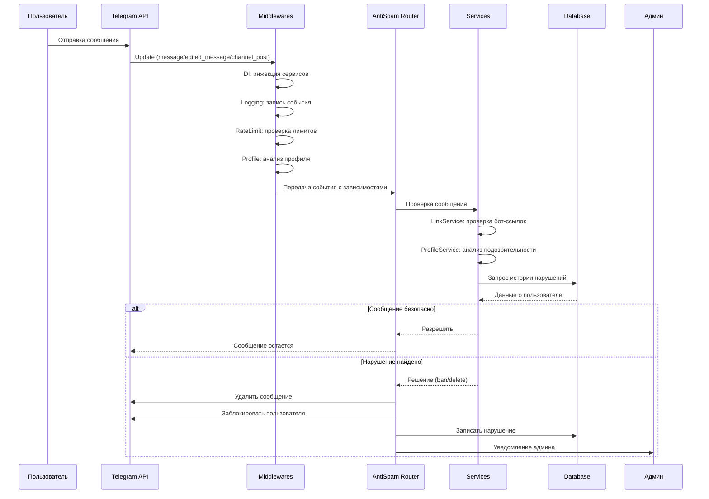

# 🏗️ Архитектура AntiSpam Bot

**📅 Обновлено: Декабрь 2024**

---

## 🎯 **ОБЗОР АРХИТЕКТУРЫ**

AntiSpam Bot использует **упрощенную двухслойную архитектуру** с четким разделением ответственности:

- **Anti-spam Router** - перехватывает ВСЕ сообщения для анализа
- **Admin Router** - обрабатывает только админские команды
- **Middleware** - обеспечивает DI, логирование и rate limiting
- **Services** - содержат бизнес-логику

## 🏗️ **ДИАГРАММА АРХИТЕКТУРЫ**



## 🔄 **ПОТОК ОБРАБОТКИ СООБЩЕНИЙ**



## 📋 **ПРАВИЛА АНТИСПАМА**

| №  | Что проверяется | Пример | Действие | Запись в БД |
|----|-----------------|--------|----------|-------------|
| 1  | **Бот-ссылки** | `t.me/username`, `@username` | Удалить + бан | +1 нарушение |
| 2  | **Подозрительные медиа** | QR-коды, документы без подписи | Удалить + бан | +1 нарушение |
| 3  | **Подозрительные профили** | Bot-подобные имена, короткие имена | Уведомить админа | Профиль в БД |
| 4  | **Rate limiting** | Слишком частые сообщения | Удалить лишние | Счетчик нарушений |
| 5  | **Sender Chat** | Сообщения от имени канала | Удалить + бан | Флаг sender_chat |
| 6  | **Форварды** | Переслано из стороннего чата | Удалить + warn | Отметка "forwarded" |

## 📁 **СТРУКТУРА МОДУЛЕЙ**

### `app/handlers/` - Обработчики событий
- **`antispam.py`** - основной антиспам фильтр (перехватывает ВСЕ сообщения)
- **`admin.py`** - админские команды
- **`channels.py`** - обработка событий каналов

### `app/services/` - Бизнес-логика
- **`moderation.py`** - бан/разбан пользователей
- **`links.py`** - проверка бот-ссылок и медиа
- **`profiles.py`** - анализ подозрительных профилей
- **`channels.py`** - управление каналами
- **`bots.py`** - управление ботами
- **`help.py`** - справка по командам
- **`limits.py`** - управление лимитами

### `app/middlewares/` - Промежуточное ПО
- **`dependency_injection.py`** - внедрение зависимостей
- **`logging.py`** - логирование событий
- **`ratelimit.py`** - ограничение частоты запросов
- **`suspicious_profile.py`** - анализ профилей

### `app/models/` - Модели данных
- **`user.py`** - пользователи
- **`channel.py`** - каналы
- **`suspicious_profile.py`** - подозрительные профили
- **`moderation_log.py`** - логи модерации

### `app/keyboards/` - Интерфейс
- **`inline.py`** - inline-кнопки для админов
- **`reply.py`** - обычные клавиатуры

## 🔄 **ПОТОК ОБРАБОТКИ**

### 1. **Сообщение в канале/группе**
```
Сообщение → Middlewares → AntiSpam Router → Services → Действие
```

### 2. **Админская команда**
```
Команда → Middlewares → Admin Router → Services → Ответ
```

### 3. **Событие канала**
```
Событие → Middlewares → Channel Router → ChannelService → Уведомление
```

## 🗄️ **БАЗА ДАННЫХ**

### Таблицы
- **`users`** - информация о пользователях
- **`channels`** - каналы (нативные/Foreign)
- **`bots`** - whitelist ботов
- **`suspicious_profiles`** - подозрительные профили
- **`moderation_log`** - логи модерации

### Связи
- Пользователи ↔ Нарушения (1:м)
- Каналы ↔ Сообщения (1:м)
- Профили ↔ Анализ (1:1)

## ⚙️ **КОНФИГУРАЦИЯ**

### Переменные окружения (`.env`)
```env
BOT_TOKEN=your_token
ADMIN_IDS=123456789,987654321
NATIVE_CHANNEL_IDS=-10000000000
DB_PATH=db.sqlite3
LOG_LEVEL=INFO
RATE_LIMIT=5
RATE_INTERVAL=60
```

### Настройки лимитов (`limits.json`)
```json
{
  "max_messages_per_minute": 10,
  "max_links_per_message": 3,
  "ban_duration_hours": 24,
  "suspicion_threshold": 0.4,
  "check_media_without_caption": true,
  "allow_videos_without_caption": true,
  "allow_photos_without_caption": true,
  "max_document_size_suspicious": 50000
}
```

## 🚀 **РАЗВЕРТЫВАНИЕ**

### Разработка
```bash
python bot.py
```

### Продакшен
```bash
# Systemd
sudo systemctl start antispam-bot.service

# Docker
docker-compose up -d
```

## 🔧 **ОСОБЕННОСТИ АРХИТЕКТУРЫ**

### 1. **Упрощенная двухслойная архитектура**
- Только 2 роутера: Anti-spam + Admin
- Четкое разделение ответственности
- Минимальная сложность

### 2. **Middleware цепочка**
- DI → Logging → RateLimit → Profile
- Все апдейты проходят через цепочку
- Централизованная обработка

### 3. **Hot-reload конфигурации**
- Изменения в `limits.json` применяются автоматически
- Без перезапуска бота
- Динамическая настройка

### 4. **Система подозрительных профилей**
- Автоматический анализ профилей
- Настраиваемые веса паттернов
- Уведомления админа с кнопками действий

### 5. **Разделение каналов**
- **Нативные** - где бот админ (мягкие правила)
- **Foreign** - откуда приходят сообщения (строгие правила)

## 📊 **МОНИТОРИНГ И ЛОГИРОВАНИЕ**

### Логирование
- **Systemd journal** - основной источник
- **Файлы логов** - резервный источник
- **Команда `/logs`** - просмотр через бота

### Мониторинг
- **`/status`** - статистика работы
- **`/settings`** - настройки системы
- **`/channels`** - статус каналов

## 🔒 **БЕЗОПАСНОСТЬ**

### Принципы
- Валидация всех входных данных
- Безопасное логирование
- Защита от инъекций
- Контроль доступа

### Рекомендации
- Регулярное обновление зависимостей
- Мониторинг логов
- Резервное копирование
- Тестирование безопасности

---

**Архитектура спроектирована для максимальной простоты и эффективности!** 🚀