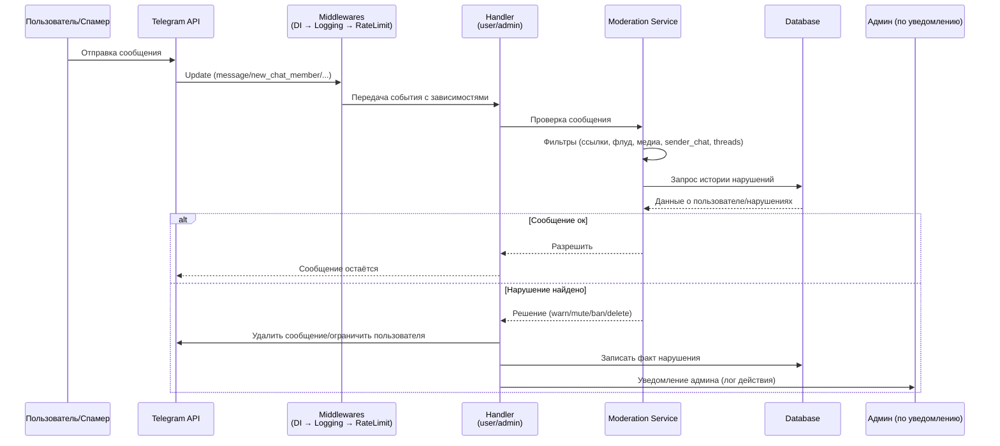

# 🏗️ Архитектура AntiSpam Bot

**📅 Обновлено на основе архитектурного аудита: 12 сентября 2025**

---

## 🏗️ **ДИАГРАММА АРХИТЕКТУРЫ**

```mermaid
flowchart TD
    subgraph Telegram
        U[Пользователь/Спамер]
        TG[API Telegram]
    end

    U --> TG

    subgraph Bot[Flame_Of_Styx_bot]
        direction TB

        subgraph Middlewares
            M1[Dependency Injection]
            M2[Logging]
            M3[Rate Limit]
        end

        subgraph Handlers
            H1[User Handlers]
            H2[Admin Handlers]
        end

        subgraph Services
            S1[Moderation Service<br>(ban/kick/warn)]
            S2[Channel Service]
        end

        subgraph Models
            DB[(Database)]
            Mdl1[User/Ban Records]
            Mdl2[Channel Configs]
        end
    end

    TG --> M1 --> M2 --> M3 --> H1
    TG --> M1 --> M2 --> M3 --> H2

    H1 --> S1
    H1 --> S2
    H2 --> S1
    H2 --> S2

    S1 --> DB
    S2 --> DB
    DB --> Mdl1
    DB --> Mdl2
```

### 📌 **Как читать архитектуру:**
- **Middlewares**: все апдейты проходят через DI → логирование → rate-limit
- **Handlers**: разделены по типу пользователей (юзер/админ)
- **Services**: здесь основная бизнес-логика антиспама
- **Models/DB**: хранение истории банов, whitelist/blacklist, конфигов

---

## 🔄 **SEQUENCE ДИАГРАММА ОБРАБОТКИ СООБЩЕНИЙ**



---

## 📋 **ТАБЛИЦА ПРАВИЛ АНТИСПАМА**

| №  | Что проверяется                    | Пример/Edge-case               | Действие бота                                         | Запись в БД                   |
| -- | ---------------------------------- | ------------------------------ | ----------------------------------------------------- | ----------------------------- |
| 1  | **Ссылки / инвайты**               | `t.me/...`, `http://...`       | Удалить сообщение, warn/ban в зависимости от настроек | +1 нарушение для user\_id     |
| 2  | **Флуд (rate-limit)**              | 5+ сообщений за < X сек        | Удалить лишние, временный mute                        | Счётчик нарушений по user\_id |
| 3  | **Спам-медиа**                     | Много фото/гиф/стикеров подряд | Удалить, варн                                         | Записать тип «media\_spam»    |
| 4  | **Повторяющийся текст**            | «Купи курс», скопипащено       | Удалить, warn                                         | Сохранить hash текста         |
| 5  | **Sender Chat (анонимные каналы)** | Сообщение от имени канала      | Удалить/бан                                           | Флаг sender\_chat = true      |
| 6  | **Комментарии к постам (threads)** | Спам в треде поста канала      | Удалить, уведомить админа                             | thread\_id + user\_id         |
| 7  | **Форварды**                       | Переслано из стороннего чата   | Удалить, warn                                         | Отметка «forwarded»           |
| 8  | **Новые участники**                | Массовый заход + пост спама    | Кик/бан сразу при первом сообщении                    | Лог join + spam\_msg          |
| 9  | **Бан-список (blacklist)**         | user\_id в чёрном списке       | Автобан при любом сообщении                           | Обновление статуса user\_id   |
| 10 | **Whitelist**                      | user\_id в списке доверенных   | Сообщения всегда пропускаются                         | Исключается из подсчёта       |

### 📌 **Как использовать таблицу:**
- **Действие бота** может настраиваться (warn → ban после N нарушений)
- **Запись в БД** нужна для того, чтобы решения были «памятливыми»
- **Whitelist/Blacklist** стоит держать в отдельной таблице

## 📁 Структура модулей

### `app/handlers/` - Обработчики событий
- **`user.py`** - новые участники, сообщения пользователей
- **`channels.py`** - сообщения от каналов (sender_chat)
- **`admin.py`** - админские команды

### `app/services/` - Бизнес-логика
- **`moderation.py`** - бан/мут/разбан пользователей
- **`links.py`** - проверка ссылок на ботов
- **`channels.py`** - управление whitelist/blacklist каналов
- **`bots.py`** - управление whitelist ботов
- **`profiles.py`** - анализ профилей GPT-ботов

### `app/middlewares/` - Промежуточное ПО
- **`logging.py`** - логирование всех событий
- **`ratelimit.py`** - ограничение частоты запросов
- **`dependency_injection.py`** - внедрение зависимостей

### `app/filters/` - Фильтры
- **`is_admin.py`** - проверка прав администратора
- **`is_admin_or_silent.py`** - проверка админа или тихое игнорирование

### `app/keyboards/` - Клавиатуры
- **`inline.py`** - inline-кнопки для админов
- **`reply.py`** - обычные клавиатуры

## 🔄 Поток обработки

1. **Новый участник** → `handlers/user.py` → `services/moderation.py`
2. **Сообщение с ссылкой** → `handlers/user.py` → `services/links.py`
3. **Сообщение от канала** → `handlers/channels.py` → `services/channels.py`
   - **Родной канал** → полная свобода
   - **Чужой канал** → проверка на спам + rate limiting
4. **Админская команда** → `handlers/admin.py` → соответствующий сервис
5. **Неадмин** → тихое игнорирование (без ответа)

## 🗄️ База данных

### Таблицы
- **`users`** - информация о пользователях
- **`channels`** - whitelist/blacklist каналов (статусы: ALLOWED, BLOCKED, PENDING, SUSPICIOUS)
- **`bots`** - whitelist ботов
- **`moderation_log`** - логи модерации
- **`suspicious_profiles`** - подозрительные профили

## 🔧 Конфигурация

- **`.env`** - переменные окружения
- **`app/config.py`** - настройки через Pydantic
- **`app/database.py`** - подключение к БД

## 🚀 Развертывание

- **Разработка**: Docker Compose
- **Продакшен**: Systemd сервис на Ubuntu 20.04
